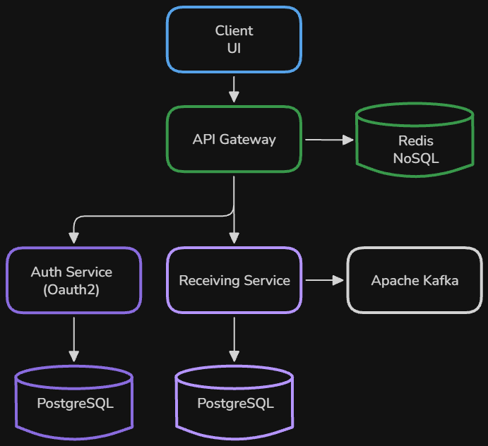
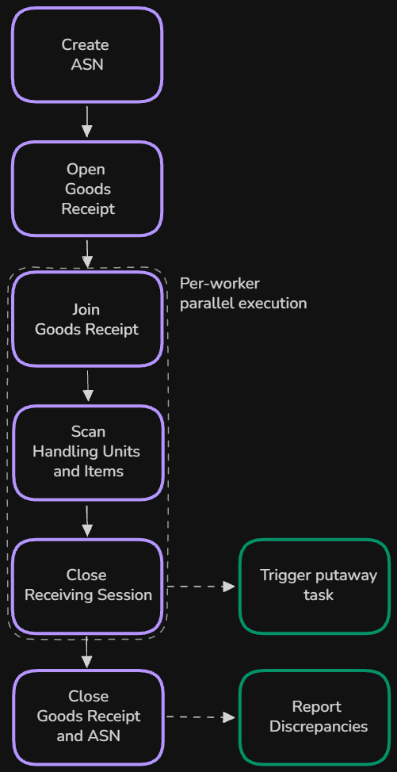
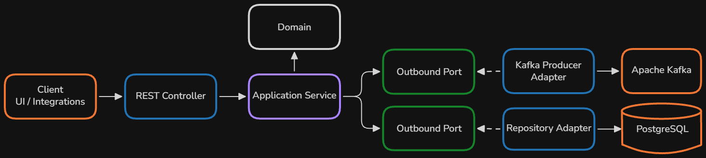

## Table of Contents
- [Overview](#simplewms)
- [System Diagram](#system-diagram)
- [Services](#services)
    - [API Gateway](#api-gateway)
    - [Receiving Service](#receiving-service)
    - [Authorization Service](#authorization-service-oauth2)
    - [Frontend](#frontend-service-in-progress)
- [API Overview – Swagger](#api-overview--swagger)
- [Getting Started](#getting-started)
- [Next Steps](#next-steps)


# SimpleWMS

Warehouse management system.
Supports goods receiving and employee management.

## System Design Diagram

<p align="center">
  
</p>

## Tech Stack

Java 25 · Spring Boot 4 · Spring Security · Spring Cloud Gateway · Hibernate/JPA · PostgreSQL · Flyway · Redis · Apache Kafka · JUnit · Mockito · Testcontainers · Docker

## Services

### API Gateway
[GitHub Repository](https://github.com/Khinya-Khinev/API-Gateway)

Single entry point for the frontend: routes requests to backend services, handles the OAuth2 Authorization Code flow as an OAuth2 Client, 
and relays access tokens downstream. Session state stored in Redis.

### Receiving Service

[GitHub Repository](https://github.com/Khinya-Khinev/Receiving-Service)

[](https://github.com/kamen-kamen/Receiving-Service/actions/workflows/ci.yaml)


#### Workflow

Service manages ASN processing, worker receiving sessions, barcode scanning, discrepancy detection.

<p align="center">
  
</p>

#### Architecture

Follows a Ports & Adapters architecture to keep the domain independent from infrastructure.
Some modules interact directly with JPA repositories where additional abstraction provides little benefit.

<p align="center">
  
</p>

### Authorization Service (OAuth2)
[GitHub Repository](https://github.com/Khinya-Khinev/Auth-Service)

OAuth2 / OpenID Connect Authorization Server for the WMS: authenticates employees, issues access/refresh/ID tokens
and manages accounts.

### Frontend Service (in progress)
[GitHub | Ivan Khramoy](https://github.com/IvanKhramoy/receiving-serivce-ui)

Web Client. Currently not included in Docker Compose.

## API Overview – Swagger 

+ Endpoints and request/responce schema: `http://localhost:8080/swagger-ui/index.html`

## Getting Started

### Prerequisites

- **JDK 25**
- **Docker**

1. Clone repositories 
```sh
./clone_all.sh
```
2. Create .env
```sh
cp .env.example .env
```
3. Start containers
```sh
docker compose up --build
   ```

If on step 3 docker shows smth like that:

#22 [receiving-service builder 5/7] RUN ./mvnw dependency:go-offline
#22 0.647 /bin/sh: 1: ./mvnw: not found
#22 ERROR: process "/bin/sh -c ./mvnw dependency:go-offline" did not complete successfully: exit code: 127

delete repos and execute
```sh
git config --global core.autocrlf false
   ```


## Next Steps
- **Simple implementations of Notification and Inventory services**: For asynchronous messaging practice (Kafka) and Saga transactions.
- **Observability**: Try out Micrometer, Prometheus, Grafana, and OpenTelemetry.
- **Outbox pattern**: Implement the Transactional Outbox pattern with Debezium for reliable Kafka event publishing.
- **Prod environment**: CI/CD and hosting on real server

